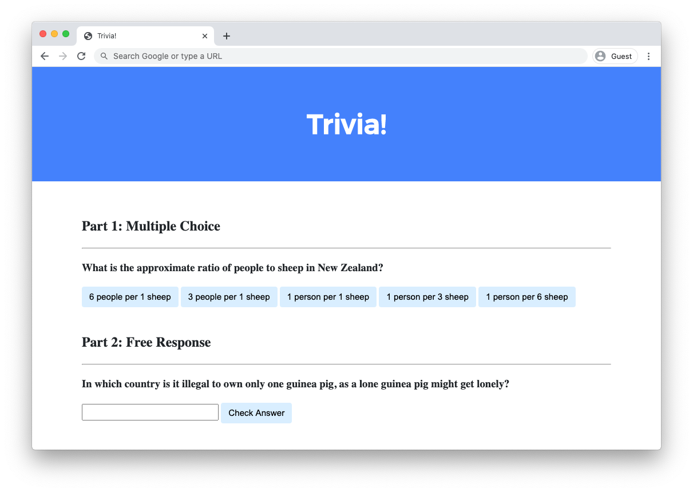

# Lab 8: Trivia

Write a webpage that lets users answer trivia questions.



## Implementation Details

Design a webpage using HTML, CSS, and JavaScript to let users answer trivia questions.

* In `index.html`, add beneath "Part 1" a multiple-choice trivia question of your choosing with HTML.
    * You should use an `h3` heading for the text of your question.
    * You should have one `button` for each of the possible answer choices. There should be at least three answer choices, of which exactly one should be correct.
* Using JavaScript, add logic so that the buttons change colors when a user clicks on them.
    * If a user clicks on a button with an incorrect answer, the button should turn red and text should appear beneath the question that says "Incorrect".
    * If a user clicks on a button with the correct answer, the button should turn green and text should appear beneath the question that says "Correct!".
* In `index.html`, add beneath "Part 2" a text-based free response question of your choosing with HTML.
    * You should use an `h3` heading for the text of your question.
    * You should use an `input` field to let the user type a response.
    * You should use a `button` to let the user confirm their answer.
* Using JavaScript, add logic so that the text field changes color when a user confirms their answer.
    * If the user types an incorrect answer and presses the confirmation button, the text field should turn red and text should appear beneath the question that says "Incorrect".
    * If the user types the correct answer and presses the confirmation button, the input field should turn green and text should appear beneath the question that says "Correct!".

Optionally, you may also:

* Edit `styles.css` to change the CSS of your webpage!
* Add additional trivia questions to your trivia quiz if you would like!

### Walkthrough



This video was recorded when the course was still using CS50 IDE for writing code. Though the interface may look different from your codespace, the behavior of the two environments should be largely similar!





### Hints

* Use [`document.querySelector`](https://developer.mozilla.org/en-US/docs/Web/API/Document/querySelector) to query for a single HTML element.
* Use [`document.querySelectorAll`](https://developer.mozilla.org/en-US/docs/Web/API/Document/querySelectorAll) to query for multiple HTML elements that match a query. The function returns an array of all matching elements.







### Testing

No `check50` for this lab, as implementations will vary based on your questions! But be sure to test both incorrect and correct responses for each of your questions to ensure that your webpage responds appropriately.

Run `http-server` in your terminal while in your `lab8` directory to start a web server that serves your webpage.

## How to Submit

1. Download your `index.html` and `styles.css` files by control-clicking or right-clicking on the file in your codespace's file browser and choosing **Download**.
2. Go to CS50's [Gradescope page](https://www.gradescope.com/).
3. Click "Lab 8: Trivia".
4. Drag and drop your `index.html` and `styles.css` files to the area that says "Drag & Drop". Be sure they have those **exact** filenames! If you upload a file with a different name, the autograder likely will fail when trying to run it, and ensuring you have uploaded files with the correct filenames is your responsibility!
5. Click "Upload".

You should see a message that says "Lab 8: Trivia submitted successfully!"



Per Step 4 above, after you submit, be sure to check your autograder results. If you see `SUBMISSION ERROR: missing files (0.0/1.0)`, it means your file was either not named exactly as prescribed, you uploaded it to the wrong problem, or you did not include all files.

Correctness in submissions entails everything from reading the specification, writing code that is compliant with it, and submitting all files with the correct names. If you see this error, you should resubmit right away, making sure your submission is fully compliant with the specification. The staff will not adjust your filenames nor upload files for you after the fact!



Want to see the staff's solution? You can find two ways of solving the problem here!

```html
<!DOCTYPE html>

<html lang="en">
    <head>
        <link href="https://fonts.googleapis.com/css2?family=Montserrat:wght@500&display=swap" rel="stylesheet">
        <link href="styles.css" rel="stylesheet">
        <title>Trivia!</title>
        <script>

            // Wait for DOM content to load
            document.addEventListener('DOMContentLoaded', function() {

                // Get all elements with class "correct"
                let corrects = document.querySelectorAll('.correct');

                // Add event listeners to each correct button
                for (let i = 0; i < corrects.length; i++) {
                    corrects[i].addEventListener('click', function() {

                        // Set background color to green
                        corrects[i].style.backgroundColor = 'Green';

                        // Go to parent element of correct button and find the first element with class "feedback" which has that parent
                        corrects[i].parentElement.querySelector('.feedback').innerHTML = 'Correct!';
                    });
                }

                // When any incorrect answer is clicked, change color to red.
                let incorrects = document.querySelectorAll(".incorrect");
                for (let i = 0; i < incorrects.length; i++) {
                    incorrects[i].addEventListener('click', function() {

                        // Set background color to green
                        incorrects[i].style.backgroundColor = 'Red';

                        // Go to parent element of correct button and find the first element with class "feedback" which has that parent
                        incorrects[i].parentElement.querySelector('.feedback').innerHTML = 'Incorrect';
                    });
                }

                // Check free response submission
                document.querySelector('#check').addEventListener('click', function() {
                    let input = document.querySelector('input');
                    if (input.value === 'Switzerland') {
                        input.style.backgroundColor = 'green';
                        input.parentElement.querySelector('.feedback').innerHTML = 'Correct!';
                    } 
                    else {
                        input.style.backgroundColor = 'red';
                        input.parentElement.querySelector('.feedback').innerHTML = 'Incorrect';
                    }
                });
            });
        </script>
    </head>
    <body>
        <div class="header">
            <h1>Trivia!</h1>
        </div>

        <div class="container">
            <div class="section">
                <h2>Part 1: Multiple Choice </h2>
                <hr>
                <h3>What is the approximate ratio of people to sheep in New Zealand?</h3>
                <button class="incorrect">6 people per 1 sheep</button>
                <button class="incorrect">3 people per 1 sheep</button>
                <button class="incorrect">1 person per 1 sheep</button>
                <button class="incorrect">1 person per 3 sheep</button>
                <button class="correct">1 person per 6 sheep</button>
                <p class="feedback"></p>
            </div>

            <div class="section">
                <h2>Part 2: Free Response</h2>
                <hr>
                <h3>In which country is it illegal to own only one guinea pig, as a lone guinea pig might get lonely?</h3>
                <input type="text"></input>
                <button id="check">Check Answer</button>
                <p class="feedback"></p>
            </div>
        </div>
    </body>
</html>
```



```html
<!DOCTYPE html>

<html lang="en">
    <head>
        <link href="https://fonts.googleapis.com/css2?family=Montserrat:wght@500&display=swap" rel="stylesheet">
        <link href="styles.css" rel="stylesheet">
        <title>Trivia!</title>
        <script>
            function checkMultiChoice(event) {

                // Get the element which triggered the event
                let button = event.target; 

                // Check if the element's inner HTML matches expected answer
                if (button.innerHTML == '1 person per 6 sheep') {
                    button.style.backgroundColor = 'Green';
                    button.parentElement.querySelector('.feedback').innerHTML = 'Correct!';
                } 
                else {
                    button.style.backgroundColor = 'Red';
                    button.parentElement.querySelector('.feedback').innerHTML = 'Incorrect';
                }
            }

            function checkFreeResponse(event) {

                // Get the element which triggered the event
                let button = event.target;

                // Get the input element corresponding to the button
                let input = button.parentElement.querySelector('input');

                // Check for correct answer
                if (input.value === 'Switzerland') {
                    input.style.backgroundColor = 'Green';
                    input.parentElement.querySelector('.feedback').innerHTML = 'Correct!';
                } 
                else {
                    input.style.backgroundColor = 'Red';
                    input.parentElement.querySelector('.feedback').innerHTML = 'Incorrect';
                }
            }
        </script>
    </head>
    <body>
        <div class="header">
            <h1>Trivia!</h1>
        </div>

        <div class="container">
            <div class="section">
                <h2>Part 1: Multiple Choice </h2>
                <hr>
                <h3>What is the approximate ratio of people to sheep in New Zealand?</h3>
                <button onclick="checkMultiChoice(event)">6 people per 1 sheep</button>
                <button onclick="checkMultiChoice(event)">3 people per 1 sheep</button>
                <button onclick="checkMultiChoice(event)">1 person per 1 sheep</button>
                <button onclick="checkMultiChoice(event)">1 person per 3 sheep</button>
                <button onclick="checkMultiChoice(event)">1 person per 6 sheep</button>
                <p class="feedback"></p>
            </div>

            <div class="section">
                <h2>Part 2: Free Response</h2>
                <hr>
                <h3>In which country is it illegal to own only one guinea pig, as a lone guinea pig might get lonely?</h3>
                <input type="text"></input>
                <button onclick="checkFreeResponse(event)">Check Answer</button>
                <p class="feedback"></p>
            </div>
        </div>
    </body>
</html>
```
